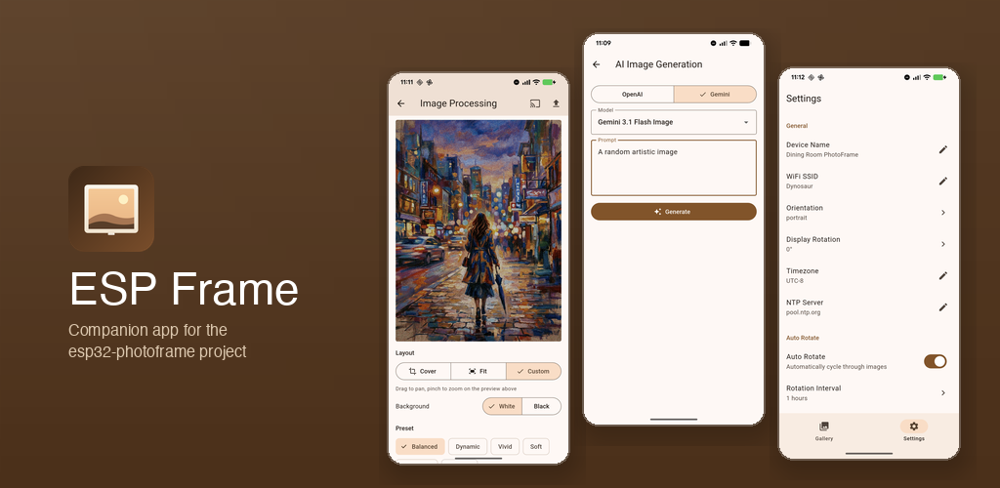

# ESP Frame

Companion app for the [esp32-photoframe](https://github.com/aitjcize/esp32-photoframe) project.



## Features

- **Device discovery** -- auto-detect photo frames on your network via mDNS
- **Gallery management** -- browse albums, upload photos, batch delete
- **Image processing** -- Floyd-Steinberg dithering, tone mapping, exposure/saturation adjustments with live preview
- **AI image generation** -- generate images with OpenAI or Google Gemini
- **Device settings** -- WiFi, orientation, auto-rotate, sleep schedule, OTA updates
- **WiFi provisioning** -- set up new devices directly from the app

## Download

**Android:**
1. Join the [Google Group](https://groups.google.com/g/esp32-photoframe-app-testers)
2. Install via [Google Play](https://play.google.com/store/apps/details?id=com.aitjcize.espframe)

**iOS:**
- [App Store](https://apps.apple.com/tw/app/esp-frame/id6762510995?l=en-GB) (USD 2.99)

> The iOS version is paid because the Apple Developer Program costs USD 99/year. The price is set to help offset that recurring cost — the Android version remains free.

## Building

Requires Flutter SDK 3.11+ and JDK 17 (Android).

```bash
flutter build apk --release
```

## Privacy Policy

<https://aitjcize.github.io/esp32-photoframe-app/privacy-policy.html>
